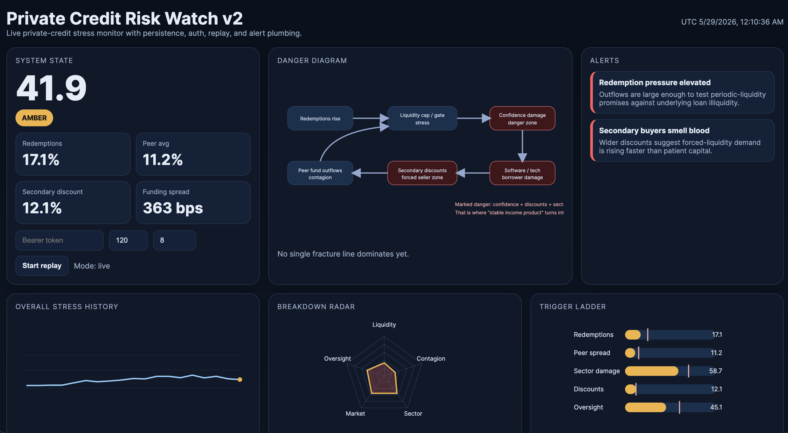
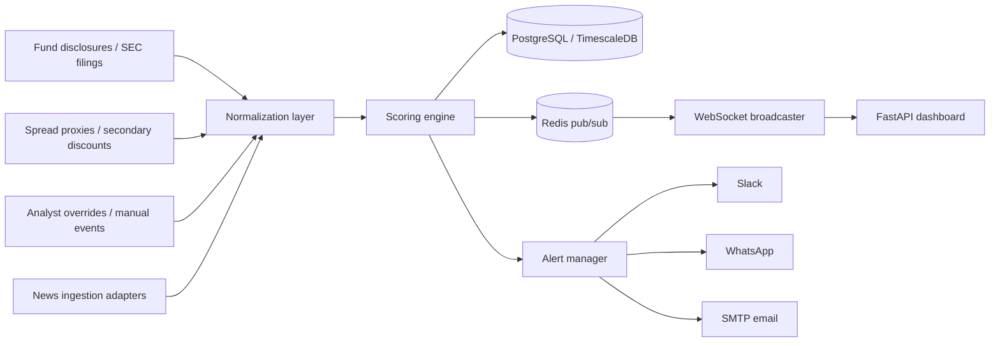
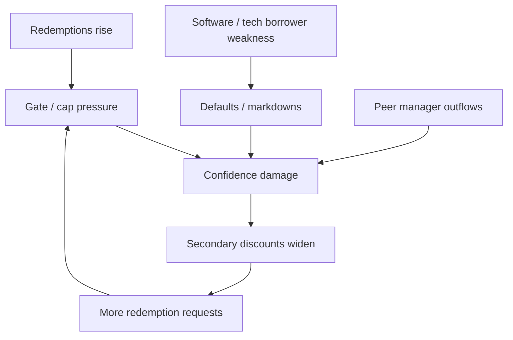

# Risk Watch



This is a small real-time credit risk monitoring project built with Python and FastAPI.

It tracks private-credit stress signals, streams updates to a dashboard, stores snapshots, and can send alerts through a few different channels.

## What it does

- streams live risk states to a web dashboard
- stores snapshots in PostgreSQL or SQLite
- supports a TimescaleDB-compatible schema
- publishes updates through Redis pub/sub
- supports token-protected replay mode
- sends alerts to console, Slack, WhatsApp Cloud API, or SMTP email
- includes diagrams for contagion loops, risk factors, and trigger levels

## Architecture



## Where danger lies



## Dashboard diagrams

The dashboard has three main visual sections:

1. **Danger diagram**  
   Shows how confidence, discounts, redemptions, and sector weakness can feed into each other.

2. **Radar chart**  
   Tracks the main risk factors:
   - liquidity mismatch
   - contagion
   - sector damage
   - market stress
   - oversight heat

3. **Trigger ladder**  
   Shows when normal stress starts turning into a more serious risk state.

## Project layout

```text
private_credit_risk_watch_v2/
├── app/
│   ├── main.py
│   ├── config.py
│   ├── models.py
│   ├── scoring.py
│   ├── engine.py
│   ├── datasource.py
│   ├── routers/
│   │   └── api.py
│   ├── services/
│   │   ├── alerts.py
│   │   ├── auth.py
│   │   ├── database.py
│   │   └── pubsub.py
│   ├── static/
│   │   └── dashboard.js
│   └── templates/
│       └── index.html
├── docker/
│   └── init.sql
├── tests/
│   ├── test_api.py
│   └── test_scoring.py
├── docker-compose.yml
├── Dockerfile
└── requirements.txt
```

## Run locally without Docker

### 1. Create environment

```bash
python -m venv .venv
source .venv/bin/activate
pip install -r requirements.txt
```

### 2. Start supporting services

You need PostgreSQL and Redis if you want the full stack. For quick local development you can stay on SQLite by leaving defaults in place.

### 3. Launch app

```bash
uvicorn app.main:app --reload
```

Open:

```text
http://127.0.0.1:8000
```

## Run full stack with Docker

```bash
docker compose up --build
```

Then open:

```text
http://127.0.0.1:8000
```

Auth token for replay mode defaults to:

```text
dev-token
```

Inside Docker it is set in `docker-compose.yml` as:

```text
changeme-super-long-token
```

## Replay mode

Replay mode is token-protected. Paste your bearer token into the dashboard and press **Start replay**.

It replays stored snapshots from the database at accelerated speed, which makes it easier to test the dashboard and alert logic against historical data.

## Replace the mock feed

The data feed is still mocked in `app/datasource.py`.

That is the file to replace with real inputs, for example:

- SEC filing parsers
- fund factsheet scrapers
- BDC discount feeds
- spread and financing proxies
- curated news event ingestion
- internal analyst overrides

## Why this is built this way

I built this to keep the risk model simple and visible. The main focus is liquidity mismatch, contagion, sector pressure, market stress, and alerting when those signals start moving together.

## WhatsApp setup

The WhatsApp sink uses Meta's WhatsApp Cloud API, not Twilio.

Set:

```env
PCRW_WHATSAPP_ACCESS_TOKEN=...
PCRW_WHATSAPP_PHONE_NUMBER_ID=...
PCRW_WHATSAPP_TO_NUMBER=49123...
```

Use the recipient number in international format without a leading `+` when following WhatsApp Cloud API conventions.
