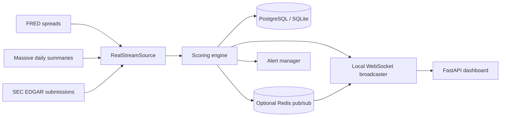

# Risk Watch


Risk Watch is a FastAPI dashboard for monitoring public-market proxies related to private-credit stress. It polls real upstream APIs, scores changed observations, stores snapshots, streams dashboard updates, and can send alerts.

It does **not** claim to observe private-fund redemptions, inflows, gates, or current private-loan NAV marks. Those require an internal administrator feed.

## Data sources

| Signal | Provider | Default input | Cadence | Meaning |
| --- | --- | --- | --- | --- |
| High-yield OAS | [FRED API](https://fred.stlouisfed.org/docs/api/fred/overview.html) | `BAMLH0A0HYM2` | 5 minutes | ICE BofA US High Yield Index option-adjusted spread |
| Listed BDC basket selloff | [Massive daily summaries](https://massive.com/docs/rest/stocks/aggregates/daily-market-summary) | `ARCC,BXSL,OBDC,MAIN,FSK,GBDC,TSLX` | 1 hour | Average completed trading-day downside move versus previous close |
| Liquid credit selloff | Massive daily summaries | `HYG` | 1 hour | Completed trading-day downside move versus previous close |
| Software-sector selloff | Massive daily summaries | `IGV` | 1 hour | Completed trading-day downside move versus previous close |
| Public filing activity | [SEC EDGAR submissions API](https://www.sec.gov/edgar/sec-api-documentation) | Configured CIKs | 15 minutes | Count of submissions over 30 days |

Every returned signal includes its provider, observation timestamp, fetch timestamp, proxy flag, and description. A snapshot is persisted and streamed only when an upstream value changes.

Massive daily market summaries are available on the free Stocks Basic plan. The dashboard uses the two latest completed trading days, so these signals are end-of-day indicators rather than intraday monitors.

The default FRED series is ICE-owned top-level index data. Review the series notes and obtain any required permission before publishing or redistributing it. FRED API access does not override third-party data restrictions.

## Setup

### 1. Create an environment

```bash
python -m venv .venv
source .venv/bin/activate
pip install -r requirements.txt
```

### 2. Configure feeds

At least one of FRED or Massive must be configured:

```env
PCRW_FRED_API_KEY=...
PCRW_MASSIVE_API_KEY=...
```

Optional SEC EDGAR monitoring requires a descriptive user agent and one or more CIKs:

```env
PCRW_SEC_USER_AGENT="risk-watch.danijel.kecman@cxromos.com"
PCRW_SEC_CIKS='["0001287750","0001736035"]'
```

SEC automated access must follow its [fair-access guidance](https://www.sec.gov/about/developer-resources). The app polls SEC every 15 minutes by default.

Optional source customization:

```env
PCRW_BDC_TICKERS='["ARCC","BXSL","OBDC","MAIN","FSK","GBDC","TSLX"]'
PCRW_CREDIT_ETF_TICKER=HYG
PCRW_SOFTWARE_ETF_TICKER=IGV
PCRW_FRED_POLL_INTERVAL_SECONDS=300
PCRW_MASSIVE_POLL_INTERVAL_SECONDS=3600
PCRW_SEC_POLL_INTERVAL_SECONDS=900
```

### 3. Run locally

SQLite and direct in-process WebSocket delivery are the defaults:

```bash
uvicorn app.main:app --reload
```

Open `http://127.0.0.1:8000`.

Without configured credentials, the service starts but waits for upstream configuration. It does not generate fake snapshots.

## Docker

Set feed credentials in `docker-compose.yml` or pass them through your deployment environment:

```bash
docker compose up --build
```

Docker enables PostgreSQL, TimescaleDB initialization, and Redis pub/sub. Redis is optional outside Docker. Enable it with:

```env
PCRW_REDIS_ENABLED=true
PCRW_REDIS_URL=redis://localhost:6379/0
```

## Scoring

The scoring engine combines:

- liquid-credit weakness
- synchronized listed-BDC repricing
- software-sector pressure
- high-yield spread widening
- optional EDGAR filing activity

These are public proxies. They are useful for monitoring market stress but are not substitutes for internal portfolio data.

## Replay mode

Replay mode streams stored snapshots at an accelerated rate. Paste the bearer token into the dashboard and press **Start replay**.

The local token defaults to `dev-token`. Docker sets `changeme-super-long-token`; replace it in deployed environments.

## Alerts

Alerts can be delivered to console, Slack, WhatsApp Cloud API, or SMTP email.

WhatsApp configuration:

```env
PCRW_WHATSAPP_ACCESS_TOKEN=...
PCRW_WHATSAPP_PHONE_NUMBER_ID=...
PCRW_WHATSAPP_TO_NUMBER=49123...
```

Use the recipient number in international format without a leading `+`.

## Architecture



## Internal-feed extension

For institution-grade private-credit monitoring, a separate adapter for administrator or portfolio-system data is needed. That adapter should provide actual redemption requests, inflows, NAV marks, non-accruals, liquidity terms, and gate events with source timestamps. Those values should not be inferred from public prices.
